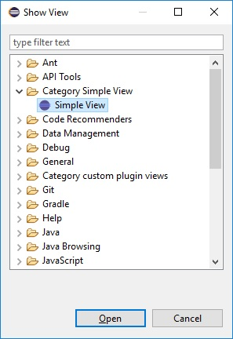
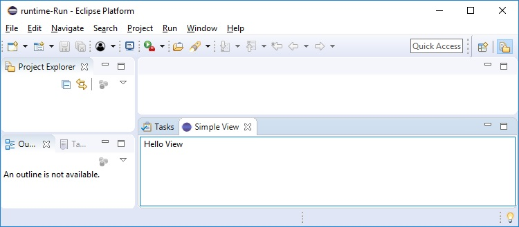
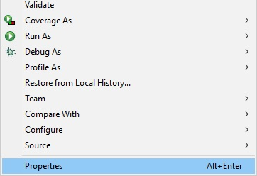
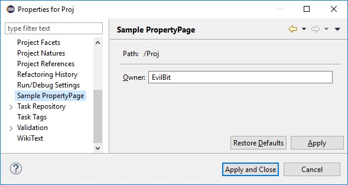
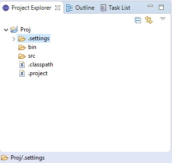
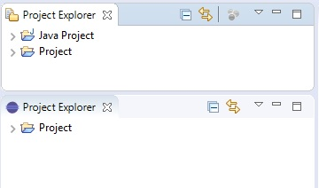
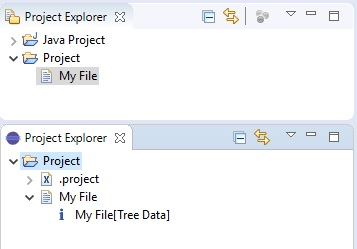
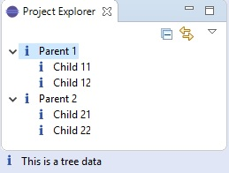
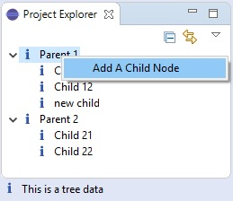
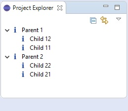

[ English ] | [ [На руском](README-RU.md) ]

# Eclipse Plugins (UI-Extensions)

In this repository, I collect the sources for the Plug-in Project Eclipse, demonstrating the creation/configuration of various UI extensions for Eclipse. The material is designed primarily for beginners.

Eclipse EE Version: 2018-09 (4.9.0) Java 1.8.0_191

1. [View](#1-View)
2. [Property Page](#2-Property-Page)
3. [Common Navigator](#3-Common-Navigator)

## 1. [View](https://github.com/firstevilbit/EclipsePlugins-UI-Extensions/tree/master/ProjectTabs/src/org/evilbit/simpleview)
This is an example of the simplest implementation of the org.eclipse.ui.views extension. To open View, click *Window> Show View > Other ... > Category Simple View> Simple View*

Plugins.xml has \<extension point="org.eclipse.ui.views"\>, which contains the settings for the view. The class field indicates the implementation of this view. It is located in the package org.evilbit.simpleview, it is an elementary class **SimpleViewClass** extending ViewPart.

Result:

 

## 2. [Property Page](https://github.com/firstevilbit/EclipsePlugins-UI-Extensions/tree/master/ProjectTabs/src/org/evilbit/propertypage)
An example implementation of the org.eclipse.ui.propertyPages extension. **Property Pages** can be opened in the following way: in **ProjectExplorer**, for example on a project, call the context menu, select the lowest menu item **Properties** and there we will see our **Sample PropertyPage**.

Plugins.xml has a \<extension point="org.eclipse.ui.propertyPages"\> that contains the settings for the page. In the class field, the implementation for propertyPages is indicated; it is in the package org.evilbit.propertypage.

Result:

 

## 3. Common Navigator

#### 1. [Create Common Navigator](https://github.com/firstevilbit/EclipsePlugins-UI-Extensions/tree/master/ProjectTabs/src/org/evilbit/navigator/views)
Implementation example **Navigator View** through the extension org.eclipse.ui.views and org.eclipse.ui.navigator.viewer. To open View, click *Window > Show View > Other ...> Category custom plugin views> Project Explorer*

All settings for displaying content are in plugins.xml. Content is displayed through View with Id = "org.evilbit.navigator.views.ProjectExplorerId". Settings for displaying content are in the extension \<extension point = "org.eclipse.ui.navigator.viewer"\>.

Source: http://codexe.net/eclipse/create-a-common-navigator.html

Result:

#### 2. [Add a filter to the Common navigator](https://github.com/firstevilbit/EclipsePlugins-UI-Extensions/tree/master/ProjectTabs/src/org/evilbit/navigator/filters)
Add the org.eclipse.ui.navigator.navigatorContent extension. We specify the class NavigatorFilter extending **org.eclipse.jface.viewers.ViewerFilter**. Set up filtering in the NavigatorFilter class, hide the display of Java projects.

Source: http://codexe.net/eclipse/add-filter-to-common-navigator.html

Result:

#### 3. [Adding your content to the Common navigator](https://github.com/firstevilbit/EclipsePlugins-UI-Extensions/tree/master/ProjectTabs/src/org/evilbit/navigator/views/navigator)
Let's make some settings in org.eclipse.ui.navigator.viewer and org.eclipse.ui.navigator.navigatorContent. The essence of the settings is as follows: Common navigator will display resource objects (what we already have) and our own type PropertiesTreeData. NavigatorContentProvider will create our nodes of type PropertiesTreeData, and NavigatorLabelProvider will create icons and labels.

Source: http://codexe.net/eclipse/add-contents-to-common-navigator.html

Result:

#### 4. [Display user data in the Common navigator](https://github.com/firstevilbit/EclipsePlugins-UI-Extensions/tree/master/ProjectTabs/src/org/evilbit/navigator/views/navigator/data)
Let's create our own data structure, the child node will be described in the PropertiesTreeData class, and the parent in the PropertiesTreeParentData class extended from PropertiesTreeData. The data structure will create the PropertiesTreeRootData class.
It is also necessary to make small changes to existing classes, such as: NavigatorContentProvider, NavigatorLabelProvider and NavigatorFilter.

Source: http://codexe.net/eclipse/show-custom-data-on-navigator.html

Result:

#### 5. [Add a menu to the Common navigator](https://github.com/firstevilbit/EclipsePlugins-UI-Extensions/tree/master/ProjectTabs/src/org/evilbit/navigator/views/navigator)
In the NavigatorActionProvider class, the context menu is initialized, and in the AddNodeAction class, we determine the conditions for the activity of the menu item and the action that will be performed.

Source: http://codexe.net/eclipse/add-menu-to-common-navigator.html

Result:

#### 6. [Add sorting to Common navigator](https://github.com/firstevilbit/EclipsePlugins-UI-Extensions/tree/master/ProjectTabs/src/org/evilbit/navigator/views/navigator/data)
Sorting is implemented in the NavigatorSorter class in the overridden compare method. The method will retrieve numbers from host names and sort them in reverse order. Sorting will happen automatically immediately after receiving the children using the getChildren (Object parentElement) method.

Source: http://codexe.net/eclipse/add-sorter-to-common-navigator.html

Result:

## 4. [Tabbed Properties](https://github.com/firstevilbit/EclipsePlugins-UI-Extensions/tree/master/ProjectTabs/src/org/evilbit/navigator/views/navigator/data)

Source: http://codexe.net/eclipse/create-tabbed-property-view.html

Result:

